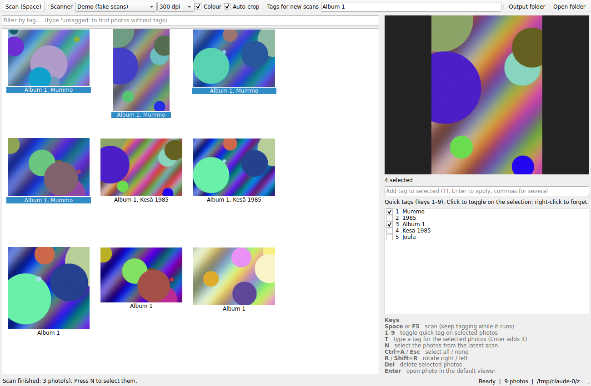

# Image Scanner

A small Windows app for digitising old photo prints quickly:

- **One key to scan.** Press **Space** (or F5). The scan runs in the background, so you can keep tagging the previous batch while the scanner works.
- **Auto-crop.** Lay several photos on the glass. Each one is found, straightened and saved as its own JPEG.
- **Fast multi-select tagging.** Select photos (click, Shift/Ctrl-click, **N** for the latest scan, Ctrl+A), then press **1–9** to toggle a quick tag or **T** to type a new one.
- **Tags go into the files.** Tags are stored in `library.json` and also written into each JPEG as Windows keywords, so Explorer and the Photos app can search them.



## Setup (Windows)

1. Install Python 3.10 or newer from [python.org](https://www.python.org/downloads/windows/) (tick "Add python.exe to PATH").
2. Install your scanner's normal Windows driver. If the scanner works in *Windows Fax and Scan*, it works here.
3. Download or clone this repository and double-click **`run.bat`**.
   The first start creates a `.venv` folder and installs the dependencies, which takes a minute.

Or from a terminal:

```bat
py -m venv .venv
.venv\Scripts\pip install -r requirements.txt
.venv\Scripts\python -m scanner_app
```

Scans are saved to `Pictures\Scans` by default. Change it with **Output folder…** in the toolbar.

## Workflow

1. Put a few photos on the scanner glass with a little space between them.
2. Optionally type tags in **Tags for new scans** (for example `Album 3, 1980s`); every photo from the next scans gets them.
3. Press **Space**. While it scans, tag the photos from the previous scan.
4. When the scan finishes, its photos appear in the grid. If nothing else was selected they are selected for you; otherwise press **N**.
5. Swap the photos on the glass and press **Space** again.

### Keys

| Key | Action |
| --- | --- |
| Space / F5 | Scan |
| 1 – 9 | Toggle quick tag 1–9 on the selected photos (adds to all; if all already have it, removes) |
| T | Type a tag for the selected photos. Enter applies it. Use commas for several. New tags become quick tags. |
| N | Select the photos from the latest scan |
| Ctrl+A / Esc | Select all / none |
| R / Shift+R | Rotate selected photos right / left |
| Del | Delete selected photos (the raw scan is kept) |
| Enter / double-click | Open in the default image viewer |

Type `untagged` in the filter box to find photos you haven't tagged yet.

## Output folder

```
Scans/
  library.json     tags for every photo
  raw/             full, uncropped scans (PNG)
  photos/          one JPEG per photo
```

## Auto-crop tips

- Leave a finger's width of space between photos and away from the glass edges.
- Prints with a white border on a white scanner lid can lose that border. For those, put a sheet of black paper over the photos before closing the lid; the border is then kept.
- If a scan has no detectable photos, the whole scan is kept as one image. Untick **Auto-crop** to always keep the full scan.

## Other options

```bat
.venv\Scripts\python -m scanner_app --demo                 rem fake scanner, to try the app
.venv\Scripts\python -m scanner_app --from-folder D:\old   rem auto-crop existing scans in a folder
.venv\Scripts\python -m scanner_app --output D:\Scans
```

## Development

The code is plain Python:

- `scanner_app/scanner.py`: WIA scanning (Windows Image Acquisition via pywin32) plus demo and folder stand-ins
- `scanner_app/cropping.py`: finding and straightening photos with OpenCV
- `scanner_app/library.py`: saving photos and tags
- `scanner_app/gui.py`: the Qt window and hotkeys

Tests run on any OS (the GUI tests use Qt's offscreen platform):

```
pip install -r requirements-dev.txt
pytest
```

To build a standalone `.exe`: `pip install pyinstaller` then `pyinstaller --windowed --name ImageScanner -p . scanner_app/__main__.py`.
