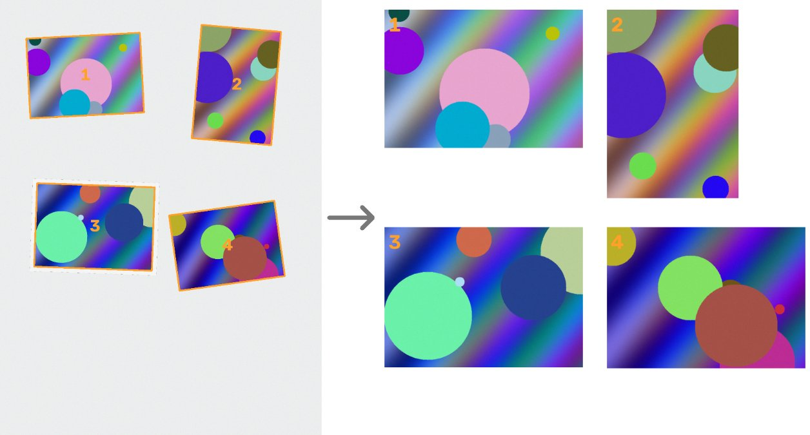

# Disclaimer

Fully done with Claude Opus 5.5

# Image Scanner

**Digitise a box of old photo prints in an evening.** Lay a few prints on the scanner, press Space, and the app cuts out every photo, straightens it and lines it up for you to tag. While the next scan runs you give the last batch a year and a few tags, press D, and they land in a folder per year with the tags built into the files, ready for PhotoPrism or any other photo library.


## Features

| | |
| --- | --- |
| ⌨️ **One key to scan** | Space starts a scan. It runs in the background, so you never wait for the scanner. |
| ✂️ **Auto-crop** | Several prints on the glass become separate, straightened JPEGs. |
| 🏷️ **Fast tagging** | Select many photos at once and toggle tags with keys 1–9. |
| 📅 **Year is required** | Every photo gets a year before it leaves the to-do list, so the collection stays organised. Add the month and day when you know them. |
| 📝 **Captions** | Write down what the back of the print says; it becomes the photo's description. |
| 📁 **Sorted by year** | Finished photos are written to `Sorted\1985\`, `Sorted\1986\`, and so on. |
| 🖼️ **Metadata in the file** | Tags, date and caption are stored as standard XMP/EXIF, read by PhotoPrism, Lightroom, digiKam and Windows Explorer. |



## Quick start

You need Windows 10 or 11 and a scanner that works in *Windows Fax and Scan* (any scanner with a normal Windows driver).

1. Install **Python 3.10 or newer** from [python.org](https://www.python.org/downloads/windows/). Tick *"Add python.exe to PATH"* in the installer.
2. [Download this repository as a ZIP](https://github.com/Joona89/image-scanner/archive/refs/heads/main.zip) and unzip it, or `git clone` it.
3. Double-click **`run.bat`**. The first start takes a minute while it installs what it needs; after that it opens straight away.

No scanner at hand? Pick **Demo (fake scans)** in the scanner menu to try everything with generated scans.

**Next: read the [short guide](docs/GUIDE.md)** for a walk-through of a scanning session.

## Keys at a glance

| Key | What it does |
| --- | --- |
| **Space** / F5 | Scan |
| **Y** | Set the date: `1985`, `85`, `6.1985`, `14.6.1985`, `1985-06-14`, or `?` for unknown |
| **C** | Set a caption for the selected photos |
| **1**–**9** | Toggle a quick tag on the selected photos |
| **T** | Type a new tag (commas for several) |
| **D** | Done: write the selected photos to their year folder |
| **N** | Select the photos from the latest scan |
| Ctrl+A / Esc | Select all / none |
| R / Shift+R | Rotate right / left |
| Shift+D | Move back to the to-do list |
| Del | Delete the selected photos |
| Enter | Open in the default image viewer |

## Where files go

```
Pictures\Scans\                  scan folder  (toolbar: Scan folder…)
├─ library.json                  date, tags, caption and state of every photo
├─ raw\                          every full scan, uncropped (PNG)
├─ photos\                       working copy of each photo
└─ Sorted\                       sorted folder  (toolbar: Sorted folder…)
   ├─ 1985\1985-06-14_scan_20260926_131500_01.jpg
   ├─ 1986\...
   └─ Unknown year\...
```

The raw scans are always kept, so nothing is lost if a crop goes wrong.

## Using it with PhotoPrism

Set **Sorted folder…** to a folder PhotoPrism indexes (for example its `originals` folder, or a subfolder of it). Every finished photo carries:

| Metadata field | Contains | Shows up in PhotoPrism as |
| --- | --- | --- |
| XMP `dc:subject` | your tags | keywords, searchable |
| EXIF `DateTimeOriginal`, XMP `photoshop:DateCreated` | the date taken (missing month or day become 1) | the date taken, so photos sort by when they were taken instead of the scan date |
| XMP `dc:description`, EXIF `ImageDescription` | the caption | the description |
| EXIF `DateTimeDigitized`, XMP `xmp:CreateDate` | when it was scanned | (kept for reference) |
| EXIF `XPKeywords` | your tags | (Windows Explorer's *Tags* column) |
| EXIF resolution | scan dpi | (used when printing) |

Photos with an unknown year get no date.

## Settings

All in the toolbar, remembered between sessions:

- **Scanner**: any WIA scanner Windows knows about, or Demo.
- **Resolution**: 75 to 2400 dpi. 300 is fine for screens, 450 or 600 for enlargements, 1200 and up for small prints and slides. If the scanner lacks the chosen value, the app scans at the next higher one it supports and scales down.
- **Colour**: off for black-and-white prints gives smaller files.
- **Auto-crop**: off keeps each scan whole.
- **Year / Tags for new scans**: applied to every photo from the next scans; handy when a whole album is from one year.

## Command line

```bat
run.bat --demo                          :: fake scanner
run.bat --from-folder D:\old-scans      :: auto-crop existing scans instead of scanning
run.bat --output D:\Scans --sorted D:\Photos
```

## For developers

Plain Python: PySide6 (Qt) for the window, OpenCV for auto-crop, pywin32 for Windows Image Acquisition, piexif for metadata.

| File | Purpose |
| --- | --- |
| `scanner_app/gui.py` | window, hotkeys, background scanning, progress |
| `scanner_app/scanner.py` | WIA scanner, demo and folder stand-ins |
| `scanner_app/cropping.py` | finding and straightening photos |
| `scanner_app/library.py` | photos, date, tags, caption, to-do and sorted folder |
| `scanner_app/metadata.py` | XMP/EXIF writing |

Tests run on any OS; the window tests use Qt's offscreen mode:

```
pip install -r requirements-dev.txt
pytest
```

Build a standalone `.exe` with `pip install pyinstaller` and `pyinstaller --windowed --name ImageScanner -p . scanner_app/__main__.py`.
