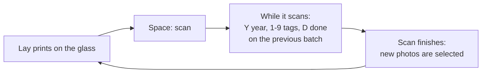

# Scanning guide

A walk-through of a typical session, from a shoebox of prints to a folder per year. It takes five minutes to read and saves hours of clicking.

## Before you start

1. **Set the folders once.** In the toolbar, **Sorted folder…** is where finished photos go. Point it at your PhotoPrism originals folder, or anywhere you like. **Scan folder…** holds the raw scans and the to-do list; the default `Pictures\Scans` is fine.
2. **Pick the resolution.** 300 dpi is plenty for viewing on screens, and 450 or 600 dpi if you might print enlargements. Higher is slower.
3. **Clean the glass.** Dust shows up on every scan, and the auto-crop can mistake big specks for tiny photos.

## The scanning loop

The app is built around one rhythm: **scan, and while it scans, finish the previous batch.**

### 1. Lay out the prints

Put 2 to 6 prints on the glass with about a finger's width between them and away from the edges. They don't need to be straight; the app straightens them.

> **White-bordered prints?** On a white scanner lid the white border can be cut off. Lay a sheet of black paper over the prints before closing the lid and the border is kept.

### 2. Press Space

The scan starts and a progress bar appears in the bottom right. You don't have to wait: go straight on to step 4 with the photos you already have.

When it finishes, the new photos appear in the **To do** list, already cut out. If you weren't in the middle of something they are selected for you; otherwise press **N** to select them.

### 3. Swap the prints

Take the scanned prints off, put the next ones on, and press **Space** again. Then deal with the photos from the scan that just finished.

### 4. Give them a year

With the photos selected, press **Y**, type the year and press Enter.

- `1985` or just `85` both mean 1985.
- `?` means you don't know. The photo goes to an *Unknown year* folder.

Different years in one scan? Click one photo, press Y, then click the next. Shift-click and Ctrl-click select several at once.

> **Tip:** if a whole album is from one year, type it in **Year for new scans** in the toolbar and every new photo gets it automatically.

### 5. Tag them

- Press **T**, type a tag such as `Mummo` and press Enter. Separate several with commas: `Mummo, Christmas`.
- Every tag you type becomes a **quick tag** with a number. Next time just press that number (**1**–**9**) to add it to all selected photos; press it again to remove it.
- The checkboxes in the quick tag list show which tags the selection already has. A filled box means some of the selected photos have it.

Tags are optional. The year is not.

### 6. Press D

The selected photos are written to `Sorted\<year>\` with the year and tags embedded, and they disappear from the to-do list.

If some of them still have no year, those stay in the list and stay selected: press **Y**, type the year, then **D** again.

### Repeat

Space, swap, Y, tags, D. After a few rounds it becomes one fluid motion, and the to-do list shows how many are left.

## Fixing mistakes

| Problem | Fix |
| --- | --- |
| Photo is sideways | Select it and press **R** (or **Shift+R** for the other way). |
| Wrong year or tag on a finished photo | Switch the view at the top left from **To do** to **Done**, select it and change it. The file in the sorted folder is updated, and moved if the year changed. |
| Want to redo a finished photo | In the **Done** view press **Shift+D** to move it back to the to-do list. |
| A crop picked up dust or cut a photo in two | Select the bad pieces and press **Del**. Rescan with Auto-crop off, or with more space between the prints. |
| Can't find untagged photos | Type `untagged` or `no year` in the filter box. |

The full scan behind every photo is always saved in the `raw` folder, so nothing is ever lost.

## Troubleshooting

**The scanner isn't in the list.** Check that it works in *Windows Fax and Scan*. If it doesn't, install the manufacturer's driver. Restart the app after plugging the scanner in.

**"The scanner does not accept … dpi".** Pick another resolution; some older scanners only offer a few.

**The progress bar just bounces.** The first scan at each resolution has no estimate yet. From the second scan on it shows roughly how far along it is, based on how long the previous one took.

**Photos don't show tags in PhotoPrism.** Make sure PhotoPrism re-indexes the sorted folder (Library → Index). Tags appear as keywords and the year as the date taken.
